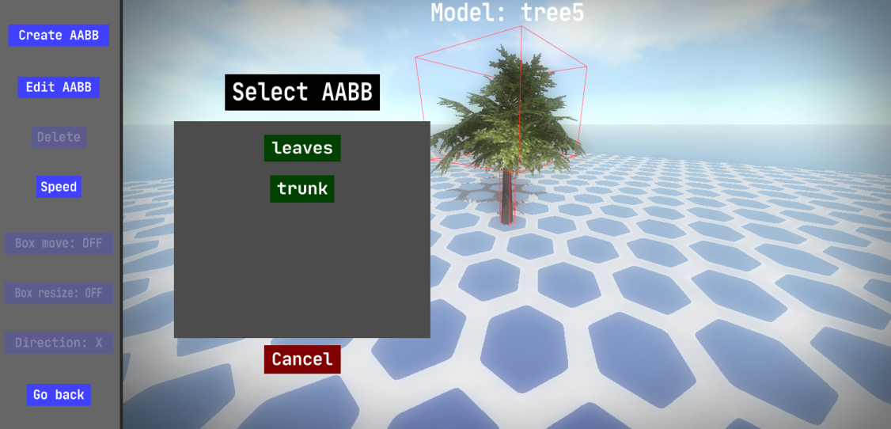

# Model Editor

### General
- You can **create/edit/delete** models.
- Every created model can be placed in a **scene** later on.
- A model must **at least** consist of a mesh.
- The mesh should be modeled so that the center is at the **lowest** vertex.
- **Mesh**: `OBJ` format mesh file from `game_assets\meshes`.
- It is good practice to make sure the **center** of your **mesh file** is **XYZ(0,0,0)** and the mesh itself is **above** the center.
- The **size** of the mesh can be altered to your liking in the "size" menu.
- The new model name **cannot consist** of the '@' character, because is it reserved by the internal engine for ID composition.
- You can toggle the **reference box** with the `R` key.
- You can toggle **debug rendering** with the `H` key.
- You can toggle **wireframe rendering** with the `F` key.
- You can **zoom the camera** with the mouse scroll wheel.
- Hold the `MMB` button to **move the camera** with your mouse.
- Use the `SPACE` key to move the camera **up** and use the `LSHIFT` key to move the camera **down**.
- Use the `UP` and `DOWN` keys to change the camera **zooming speed**.
### Texturing
- **Diffuse map**: colored 24bit/32bit `PNG` format image file from `game_assets\textures\diffuse_maps\`.
- **Light map**: colored 24bit `PNG` format image file from `game_assets\textures\light_maps\`.
- **Reflection map**: colored 24bit `PNG` format image file from `game_assets\textures\reflection_maps\`.
- **Normal map**: colored 24bit `PNG` format image file from `game_assets\textures\normal_maps\`.
### Multiparted mesh
- A mesh can consist of **multiple parts** (including textures for every part).
- In the **.obj** file, you need to specify when a certain part of vertices starts.
- You can start a new mesh part by writing `FE3D_PART <name>` in the OBJ file.
- You can bind a **diffuse** map to the part by writing `FE3D_DIFFUSE_MAP <path><filename>` on the next line.
- You can bind a **light** map to the part by writing `FE3D_LIGHT_MAP <path><filename>` on the next line.
- You can bind a **reflection** map to the part by writing `FE3D_REFLECTION_MAP <path><filename>` on the next line.
- You can bind a **normal** map to the part by writing `FE3D_NORMAL_MAP <path><filename>` on the next line.
- The `<path`> starts from the directory `game_assets\textures\<texture_type>\`.
### AABB editor

- You can bind 1 or more **AABBs** to the model using the AABB editor within the model editor.
- Every individual AABB has its own local **position and size** that you can alter with a customizable **speed**.
- All AABBs are **bound** to the model's **transformation** (translation, rotation, scaling), so the AABBs will transform with the model.
### Properties
- **Mesh size**: size multiplier of the mesh. **Range**: 0 to inf.
- **Reflection**: enable or disable reflection of sky or scene. **Range**: sky or scene or OFF.
- **Shadowed**: enable or disable shadow rendering on the model. **Range**: ON or OFF.
- **Culling**: enable or disable the face culling optimization. **Range**: ON or OFF.
- **Alpha**: enable or disable transparent pixels removal from diffuse map(s). **Range**: ON or OFF.
- **Specular**: enable or disable specular lighting on the model. **Range**: ON or OFF.
- **Spec factor**: the shininess of the specular lighting. **Range**: 0 to 256.
- **Spec intensity**: the intensity of the specular lighting. **Range**: 0 to inf.
- **Lightness**: the brightness of the model fragments. **Range**: 0 to inf.
- **Color**: the RGB color that will be mixed with the model rendering. **Range**: 0 to 255.
- **UV repeat**: the amount of times the diffuse map texture is repeated. **Range**: 0 to inf.
- **instanced**: enable or disable instanced rendering. This means that the model can be rendered VERY efficiently in large numbers. This option will also disable AABB's for this model. **Range**: ON or OFF.
- **Level of detail**: the name of another created model representing a lower quality version of the current model. If the model is placed in a scene and is farther than the LOD distance, the mesh will be replaced with the specified level of detail mesh. If you want to remove the LOD, fill in "@" as LOD name.
