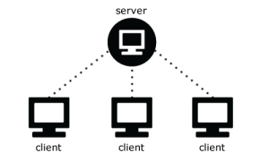

# Networking

### Server
- A FabiEngine3D server is a **separate application** that runs on its own.
- It is **NOT** a game and its only purpose is processing incoming/outgoing messages from/to clients.
- Before you can call any server scripting functions, the client **must be started**.
- You can **only** start a server in an **initialization script** before **any** other FE3D scripting functions are called.
- If you **export** the server project there will be no window displaying, only the **logging console**.
- The server is hosted on the **IPV4 address** of your computer (write `ipconfig` in your Windows command prompt to look it up).
- You can **portforward** the server in your router settings on **port 61205** for both **TCP & UDP** protocols.
- There can be **only 1** FabiEngine3D server running on the same machine.
- A server can **only** access: `server_*`, `directory_*`, `file_*`, `timer_*`, `application_stop`, `print`, `time_interval`.
- The server can **send/receive** messages to/from clients.
- You can set a **maximum** amount of **clients** that can connect to the server.
- Be careful with **performance heavy operations** in the server scripts, otherwise it might not be able to handle client messages in time.
- The server runs at the **maximum update speed** possible (it **overrides** the 144 ticks/second engine default).

### Client
- A FabiEngine3D client system exists **within a FabiEngine3D game**.
- You can start a client **whenever** you want (for example when the user logs into their account or wants to join a game).
- The client can connect to a **maximum of 1 server**.
- Before you can call any client scripting functions, the client **must be started & connected** to a server.
- You can always retrieve **pending messages**, because of error messages sent by the server if the connection attempt went wrong.
- When connecting to a server, **error messages** can be received: `SERVER_FULL`, `USER_ALREADY_CONNECTED`, `DISCONNECTED_BY_SERVER`.
- The client can **send/receive** messages to/from the server.
- When you start a client, you must pass a **username** into the scripting function. This username cannot be longer than **16 characters**.

### TCP & UDP
- On top of the IP protocol, there are 2 different **protocols** for sending data through networking: TCP & UDP.
- TCP: this protocol guarantees that the sent data will **ALWAYS** arrive at the recipient in the same order the data was sent.
- UDP: this protocol can **NOT** guarantee that the data will arrive at the recipient (even though 99% of the messages will).
- Performance-wise UDP is much **faster** than TCP because of the reliability differences.
- **TCP example** scenario: you have a multiplayer game with a live chat. The chat messages must always arrive (in the same order).
- **UDP example** scenario: you need to send player positions to other players through the server. It is no big deal if some data gets lost.
- You can choose which protocol you want to use when sending a message. This gives you more control over **performance decisions**.

### Messaging
- A network message must **NOT** be longer than **128 characters** or contain any **semicolons (;)**.
- There is **no guarantee** that if you send multiple messages right after each other, they will arrive at the same time.
- Some messages are **reserved** for the engine: `SERVER_FULL`, `USER_ALREADY_CONNECTED`, `ACCEPTED`, `PING`, `DISCONNECTED_BY_SERVER`.
- Every **update/tick** in either the server or the client, the **pending messages** will be cleared before receiving new messages.
