# Theoretical Framework
- **C++**: a powerful and fast programming language used a lot in game development.
- **OpenGL**: a 3D graphics library.
- **SDL2**: a multimedia library that supports things like rendering, asset loading, input, etc.
- **Translation**: this word is equal to "movement".
- **Scaling**: this word is equal to "size".
- **Transformation**: the combination of translation, rotation, scaling.
- **Collision**: intersection between 2 things (for example: between the camera and a model).
- **Raycasting**: the process of "shooting" a ray from the camera position towards where the camera is looking.
- **Model**: a complex 3D object in 3D space, constisting of a mesh.  

- **Billboard**: a 2D quad in 3D space.  

- **AABB**: Axis Aligned Bounding Box, a 3D box used for collision.  

- **LOD model**: Level Of Detail model, a less-detailed version of a model.  
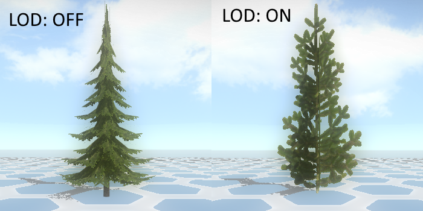
- **Ambient lighting**: the overall lightness of a scene.  

- **Directional lighting**: diffuse lighting based on a directional light source (example: the sun).  

- **Point lighting**: individual light casters that show light around them (example: a torch).  

- **Spot lighting**: a spot light casted from the camera position towards where the camera is looking (example: a flashlight).  

- **Specular lighting**: specular lighting is a light reflection from any light caster.  

- **DOF**: Depth Of Field, a post-processing effect that blurs all non-focused pixels.  
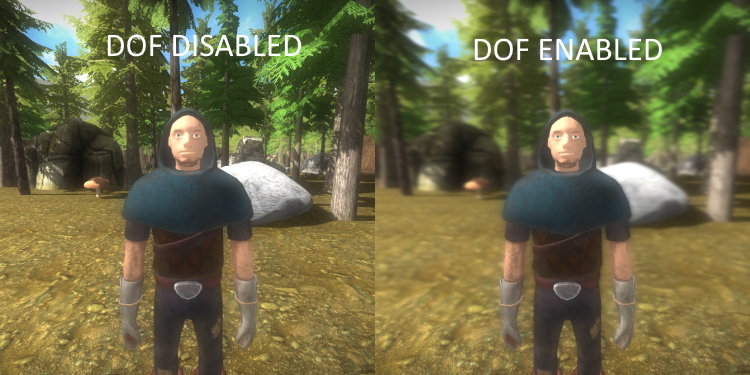
- **Fog**: the whole scene can have a foggy effect.  

- **Shadows**: models can be shadowed for a more realistic scene.  

- **Motion blur**: pixels will be blurred in the first person camera direction of motion.  
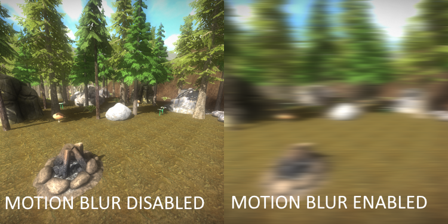
- **Sky HDR**: an effect that effects the brightness of the sky based on the camera pitch angle.  

- **Diffuse mapping**: using a texture to give a variety of colors to a model.  
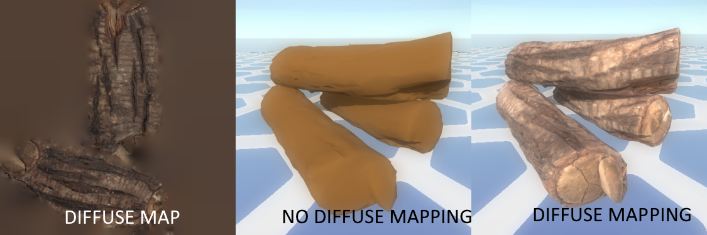
- **Light mapping**: using a texture to make parts of a model brighter.  
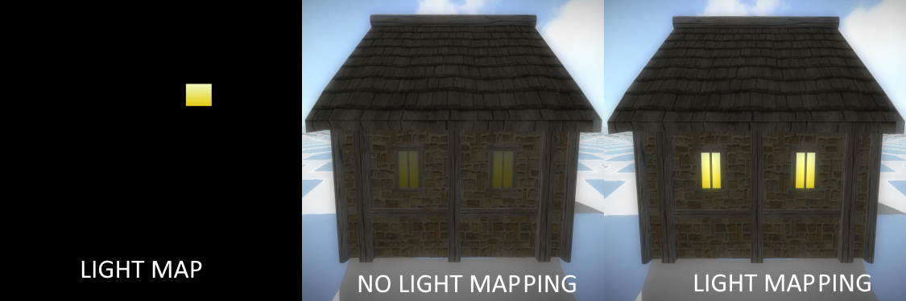
- **Reflection mapping**: using a texture to make parts of a model reflective.  

- **Normal mapping**: using a texture to improve lighting effects on a model.  
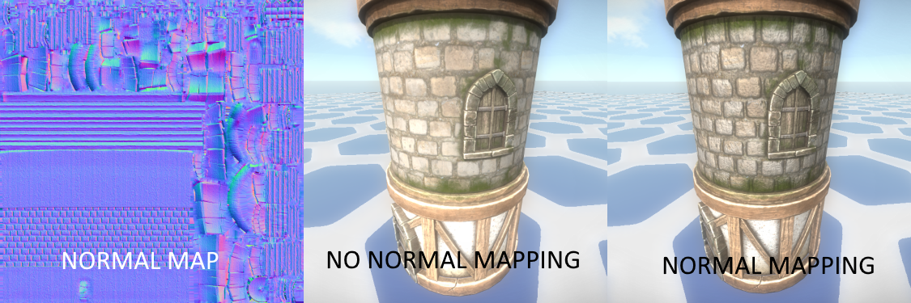
- **Height mapping**: using a grayscale texture to generate a terrain.  
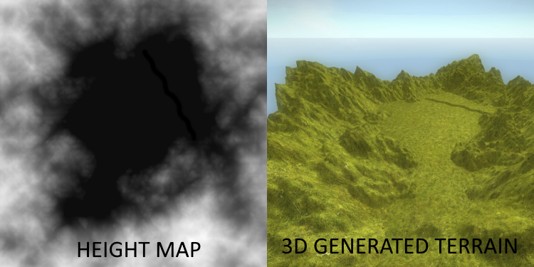
- **Blend mapping**: using a texture to blend multiple textures onto a terrain.  

- **DUDV mapping**: using a texture to distort the texture of a water surface (example: water ripples).  
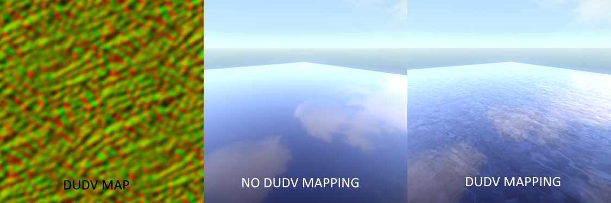
- **Displacement mapping**: using a texture to create waves in the water surface mesh.  
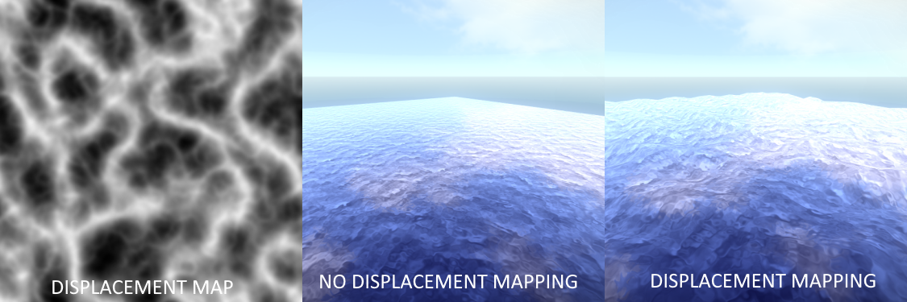
- **Flare mapping**: using a texture to achieve a lens flare effect when the camera is looking at a directional lighting caster.  

- **Cube mapping**: using a texture to give a variety of colors to a 3D cube map.  
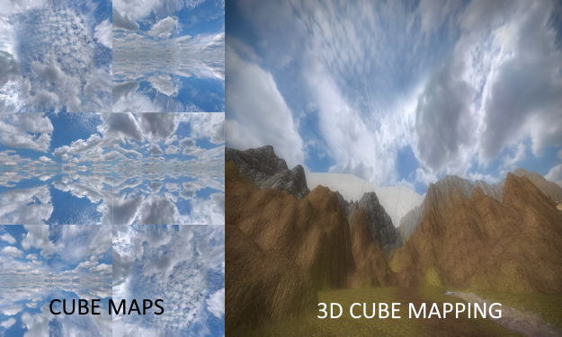
- **Billboard mapping**: using a texture to give a variety of colors to a billboard.  

- **Image mapping**: using a texture to give a variety of colors to a GUI image.  
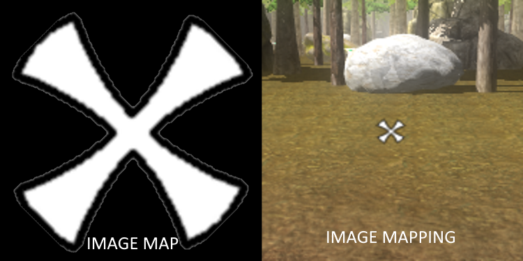
